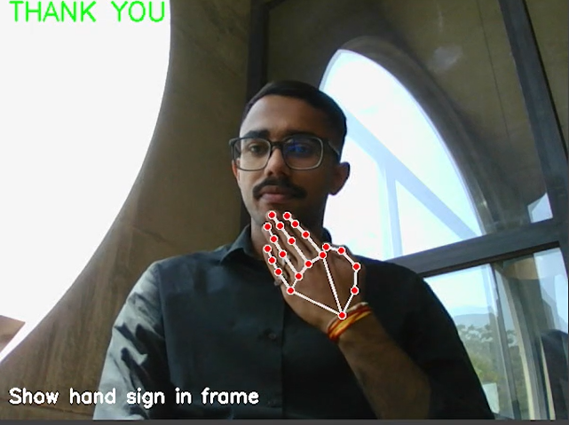

# Sign Language Interpreter

This project is an AI-based sign language interpreter that recognizes and translates hand signs into text. It uses a pre-trained deep learning model to identify specific hand gestures.

## Pre-Trained Model
The model has been trained to recognize the following hand signs:
- HELLO
- YES
- NO
- I LOVE YOU
- GOOD
- THANK YOU
- CUTE
- WHAT
- WHO

## How It Works
The system captures real-time video feed, detects hand gestures using keypoint tracking, and classifies them into the corresponding sign language gestures.

### Example Images
Below are examples of the model in action:

#### Recognizing "NO"


#### Recognizing "WHAT"


#### Recognizing "THANK YOU"


#### Recognizing "GOOD"


## Installation and Usage
1. Clone the repository:
   ```bash
   git clone https://github.com/your-repo/sign-language-interpreter.git
   cd sign-language-interpreter
   ```
2. Install dependencies:
   ```bash
   pip install -r requirements.txt
   ```
3. Run the application:
   ```bash
   python main.py
   ```

## License
This project is licensed under the MIT License.

